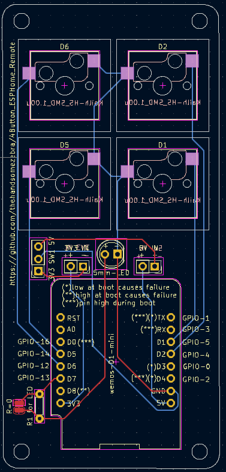

# 4Button_ESPHome_Remote
A 4 button remote that can be tied to automations in Home Assistant


Idea is this: ESPHome item that uses an ESP8266 D1 Mini module that has 4 buttons coming from it.
I like the idea of the shortcut buttons or the aqara cube: but I wanted something that I had parts for already.  I've got D1's and key switches galore, so I'll start there for now.

First step will be getting something working -- End goal will be a custom PCB with a 3D printed case for this "remote controller" with battery compartment.


Buttons will be 4 mechanical key switches..

Some notes that I've found regarding the pins specifically...

```
Pins used during Boot
The ESP8266 can be prevented from booting if some pins are pulled LOW or HIGH. The following list shows the state of the following pins on BOOT:

D0 - GPIO16:    *** pin is high at BOOT
D3 - GPIO0:     * boot failure if pulled LOW
D4 - GPIO2:     *** pin is high at BOOT,
                * boot failure if pulled LOW
D8 - GPIO15:    ** boot failure if pulled HIGH
RX - GPIO3:     *** pin is high at BOOT
TX - GPIO1:     *** pin is high at BOOT, 
                * boot failure if pulled LOW
```
(info from https://randomnerdtutorials.com/esp8266-pinout-reference-gpios/)



I don't want collissions, so I'll use D1, D2, D5 & D6.


This is a thread that I am following to get ideas for the YAML.
https://community.home-assistant.io/t/esphome-button-held-double-press/136083/7


